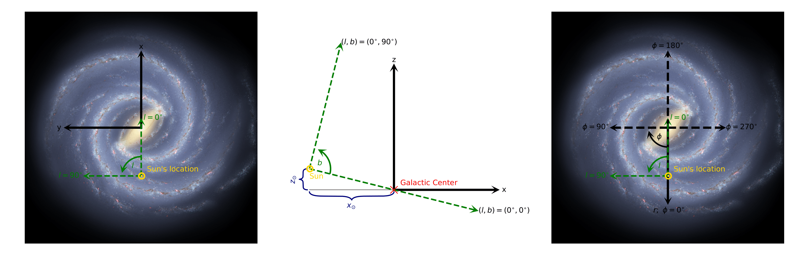

Output
=======

Default basic outputs
----------------------

.. list-table:: 
   :widths: 25 15 100
   :header-rows: 1

   * - column name
     - units
     - description
   * - pop
     -
     - population number
   * - iMass
     - M\ :sub:`Sun`
     - initial mass
   * - age
     - Gyr
     - current age
   * - Fe/H_initial
     - dex
     - initial metallicity
   * - Mass
     - M\ :sub:`Sun`
     - current mass
   * - In_Final_Phase
     - 
     - flag for stars beyond AGB phase
   * - Dist
     - kpc
     - distance from Sun
   * - l, b
     - degree
     - Galactic longitude, latitute
   * - vr_bc
     - km/s
     - radial velocity in barycentric frame
   * - mul, mub
     - mas/yr
     - proper motion in Galactic coordinates
   * - x, y, z
     - kpc
     - position in Galactic cartesian coordinates (see Figure)
   * - U, V, W
     - km/s
     - velocity in Galactic cartesian coordinates (see Figure)
   * - VR_LSR
     - km/s
     - radial velocity in local standard of rest frame
   * - A_<band>
     - mag
     - extinction in <band>, as specified by the extinction map

Outputs from MIST evolution
----------------------------

For the default stellar evolution method, we use the `MIST packaged model isochrones <https://waps.cfa.harvard.edu/MIST/model_grids.html>`_.

.. note::
    Any/all of these columns can be selected or excluded via ``opt_iso_props`` in the configuration and may be renamed via ``col_names``.

.. list-table:: 
   :widths: 25 25 50
   :header-rows: 1

   * - column name in MIST
     - units
     - description
   * - [Fe/H]
     - dex
     - current metallicity
   * - log_L
     - log L\ :sub:`Sun`
     - bolometric luminosity
   * - log_Teff
     - log Kelvin
     - effective temperature
   * - log_g
     - log cm/s/s
     - surface gravity
   * - log_R
     - log R\ :sub:`Sun`
     - radius
   * - phase
     - 
     - evolutionary phase, with -1=PMS, 0=MS, 2=RGB, 3=CHeB, 4=EAGB, 5=TPAGB, 6=postAGB, 9=WR
